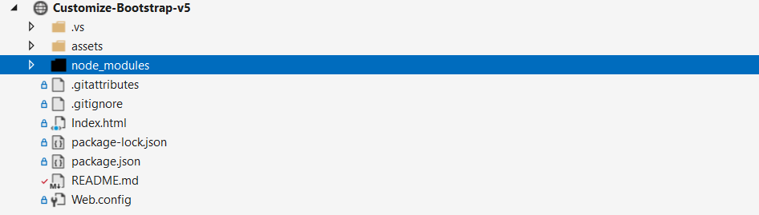

<h1>راهنمای سریع کار با پروژه TehranIT Web</h1>
<h2>نصب پکیج‌ها</h2>

اگر از همین ریپو استفاده می‌کنید و <code>node_modules</code> را دارید، این مرحله لازم نیست. و در غیر اینصورت ترمینال را باز کنید و بزنید:

<pre><code>npm install bootstrap sass</code></pre>

<h2>بیلد کردن CSS</h2>

بعد از هر تغییر در SCSS می‌توانید خروجی CSS بگیرید:

<pre><code>npx sass --load-path=node_modules .\assets\scss\app.scss .\assets\css\bootstrap-custom.min.css --style=compressed; npx rtlcss .\assets\css\bootstrap-custom.min.css .\assets\css\bootstrap-custom.rtl.min.css</code></pre>

<b>خروجی‌ها:</b>

نسخه LTR بوت استرپ <code>assets/css/bootstrap-custom.min.css</code>

نسخه RTL بوت استرپ <code>assets/css/bootstrap-custom.rtl.min.css</code>

<h2>اضافه‌کردن رنگ‌های سفارشی</h2>

<b>گام اول : </b>تعریف رنگ در<code>assets/scss/custom/_variables.scss</code>

<pre><code>$color-a: #0e71eb;
$color-b: #21c08b;</code></pre>

<b>گام دوم : </b>افزودن به نقشهٔ تم در<code>assets/scss/app.scss</code>

<pre><code>$theme-colors-extended: (
  "primary":   theme.$primary,
  "secondary": theme.$secondary,
  "success":   theme.$success,
  "info":      theme.$info,
  "warning":   theme.$warning,
  "danger":    theme.$danger,
  "light":     theme.$light,
  "dark":      theme.$dark,
  //رنگ‌های سفارشی
  "color-a":   theme.$color-a,
  "color-b":   theme.$color-b
);</code></pre>

<h2>افزودن تم - ویرایش رنگ تم - دارک مد</h2>

میتوانید در <code>assets/scss/custom/_themes.scss</code> تم خود را اضافه کنید. و رنگ های مورد نظر خود را ست کنید. در کد زیر ما تم دارک را اضافه کردیم. شما میتوانید به تعداد مورد نیاز خود تم اضافه کنید.

<b>نکته: </b> برای هر رنگ سفارشی دو مقدار بگذار: یکی Hex و یکی RGB (برای شفافیت‌ها).

<pre><code>//تم دارک
[data-bs-theme="dark"] {
    color-scheme: dark;
    --bs-body-bg: #0f172a;
    --bs-body-color: #e5e7eb;
    --bs-primary: #0E71EB;
    --bs-secondary: #94a3b8;
    --bs-success: #22c55e;
    --bs-info: #38bdf8;
    --bs-warning: #f59e0b;
    --bs-danger: #ef4444;
    --bs-light: #1f2937;
    --bs-dark: #0b1324;
    --bs-link-color: var(--bs-primary);
    //رنگ سفارشی
    --bs-color-a: #ffffff;
    --bs-color-a-rgb: 255,255,255;
    --bs-color-b: #ff0000;
    --bs-color-b-rgb: 255,0,0;
}</code></pre>

<h2>استفاده از تم ها در HTML</h2>

با اتریبیوت <code>data-bs-theme</code> تم عوض میشود. و با کلاس <code>theme-fade</code> تعویض انیمیشنی تم را داریم. این اتریبیوت و کلاس را به تگ Html اضافه کنید.

<pre><code>&lt;html lang="fa" dir="rtl" class="theme-fade" data-bs-theme="light"&gt;</code></pre>

این اسکریپت باید قبل از تگ استایل بوت استرپ اضافه شود.

<pre><code>    &lt;script&gt;
        (function () {
            var saved = localStorage.getItem('theme');
            if (!saved) saved = window.matchMedia('(prefers-color-scheme: dark)').matches ? 'dark' : 'light';
            document.documentElement.setAttribute('data-bs-theme', saved);
        })();
    &lt;/script&gt;
    &lt;!-- Bootstrap CSS --&gt;
    &lt;link href="assets/css/bootstrap-custom.min.css" rel="stylesheet" /&gt;</code></pre>

از دکمه زیر برای تغییر تم استفاده کنید. فرض ما این است دو تم Light و Dark دارید.

<pre><code>            &lt;button id="themeToggle" class="btn btn-outline-light btn-sm"&gt;
                تغییر حالت دارک / لایت
            &lt;/button&gt;</code></pre>

افزودن اسکریپت در فایل جاوا اسکریپت

<pre><code>        (function () {
            var btn = document.getElementById('themeToggle');
            btn.addEventListener('click', function () {
                var html = document.documentElement;
                var current = html.getAttribute('data-bs-theme');
                var next = (current === 'dark') ? 'light' : 'dark';
                html.setAttribute('data-bs-theme', next);
                localStorage.setItem('theme', next);
            });
            // اختیاری: اگر کاربر ترجیح سیستم را عوض کرد و شما ترجیح ذخیره‌شده‌ای نگه نداشتید
            var mq = window.matchMedia('(prefers-color-scheme: dark)');
            mq.addEventListener?.('change', function (e) {
                if (!localStorage.getItem('theme')) {
                    document.documentElement.setAttribute('data-bs-theme', e.matches ? 'dark' : 'light');
                }
            });
        })();</code></pre>

<h2>فونت ها</h2>

در این مسیر <code>assets/fonts/YourFont/</code> فایل های فونت خود را کپی کن.

در این مسیر <code>assets/scss/custom/_fonts.scss</code> فونت فیس های خود را قرار میدهیم.

و در مسیر <code>assets/scss/custom/_variables.scss</code> باید فونت خود را به بوت استرپ معرفی کنیم.

بهتر است در این مسیر هم <code>assets/scss/custom/_typography.scss</code> فونت معرفی شود.

<pre><code>$font-sans: "Vazirmatn", system-ui, -apple-system, "Segoe UI", Roboto, "Helvetica Neue", Arial, sans-serif;</code></pre>

<h2>تایپوگرافی سراسری پروژه</h2>

در این مسیر <code>assets/scss/custom/_typography.scss</code> میتوانید تایپوگرافی سراسری پروژه را تنظیم کنید. 

<h2>تنظیمات فرم‌ها و دراپ‌دان‌ها</h2>

در پایین فایل <code>assets/scss/custom/_themes.scss</code> بخش مربوط به Form و Dropdown قرار دارد. این تنظیمات برای همه تم‌ها مشترک است و رنگ‌ها را از متغیرهای هر تم می‌خواند، بنابراین با تغییر رنگ‌ها در بخش هر تم، این اجزا نیز به‌صورت خودکار به‌روزرسانی می‌شوند.

<pre><code></code></pre>

<h2></h2>

<pre><code></code></pre>